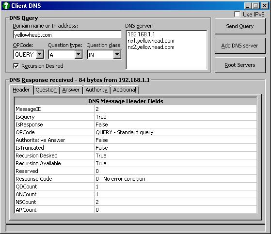



## ClientDNS \- IPv6

### Description

ClientDNS is a utility program designed and intended to give you full access to the DNS packets

returned from the requested server. DNS packets are very compact and highly cryptic, and because of that, command line utilities like "NSLookUP" will display incomplete interpretted results. ClientDNS returns all the results on separate tabs.

ClientDNS has been tested to be UAC compatible.

Internet standards require DNS servers to accept both UDP and TCP requests. TCP is very seldom used however, and some servers do not accept them due to firewall restrictions on port 53. ClientDNS does not support TCP.

ClientDNS finds and uses your default DNS servers to get the IP addresses of the named servers. Consequently, it cannot be used to troubleshoot your own DNS service unless you manually enter the IP address of the server. This version supports IPv6, but it has experienced limited testing in this mode because of the inavailability of IPv6 transport. Feedback would be welcome.

Update: Further testing with IPv6 showed up some errors when using a Teredo Tunnel. The program was attempting to use the default IPv4 DNS server to find other servers, so it was modified to extract the IPv6 default DNS servers from the registry when using IPv6. As well, the state of the chkIPv6 checkbox was saved to the registry on exit. I also found that I kept forgetting to change the Question Type to "AAAA" when using IPv6, so the default is automatically changed

whenever the IP version is changed.

PLEASE NOTE: This program supports both IPv4 and IPv6. It utilizes ws2_32.dll, which only exists on operating systems that support IPv6. This includes both Vista and Win7. It will not compile on older operating systems.
 
### More Info
 

             |
---                |---
**Submitted On**   |2012-06-14 08:52:36
**By**             |[J\.A\. Coutts](https://github.com/Planet-Source-Code/PSCIndex/blob/master/ByAuthor/j-a-coutts.md)
**Level**          |Advanced
**User Rating**    |5.0 (15 globes from 3 users)
**Compatibility**  |VB 6\.0
**Category**       |[Complete Applications](https://github.com/Planet-Source-Code/PSCIndex/blob/master/ByCategory/complete-applications__1-27.md)
**World**          |[Visual Basic](https://github.com/Planet-Source-Code/PSCIndex/blob/master/ByWorld/visual-basic.md)
**Archive File**   |[ClientDNS\_2225016152012\.zip](https://github.com/Planet-Source-Code/j-a-coutts-clientdns-ipv6__1-74311/archive/master.zip)

